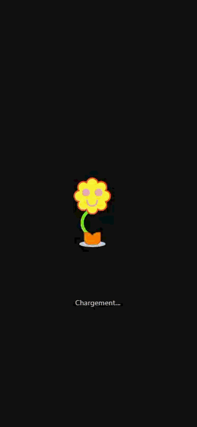

# Animation au format Lottie

**Consignes de l’exercice :**

- Réaliser **une animation courte en utilisant le [1er principe Squash & Stretch](https://youtu.be/uDqjIdI4bF4?si=0vsnphouqZ-nDurX&t=11)** avec After Effects ou [Cavalry](https://cavalry.studio/fr_fr/) (la démo du cours se fait avec [Cavalry](https://cavalry.studio/fr_fr/))
- L’animation doit être prévue pour **le lancement initial du projet** (logo, loading…) en **cohérence graphique avec vos projets**
- Exporter l’animation au **format Lottie** (attention Lottie ne permet pas tout, restez dans le scope)
- **Intégrer l’animation dans une page Web** au format du projet desktop ou mobile
- Faire **jouer l’animation en tant que chargement puis faire disparaître l’animation et afficher le contenu de votre première slide** de onboarding (uniquement la première)
- Il doit y avoir **une transition et des animations dans l’affichage du contenu de la première slide** de votre onboarding (avec GSAP par exemple)

>> Nous n’utilisons pas Lottie comme une vidéo décorative, mais comme un état temporaire d’interface. L’animation accompagne le chargement, puis déclenche une transformation de la page lorsque sa timeline se termine.
